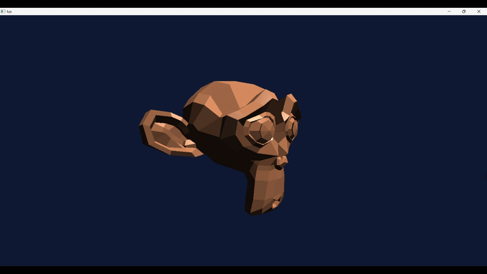

# lux



Real-time DirectX 12 renderer written from scratch in C++. Built as a learning project and portfolio piece toward a graphics programmer role.

**Author:** Renato Castillo — started 2026-04-20

---

## What it does (current state)

- Win32 window with full resize support
- D3D12 device, double-buffered swap chain, depth buffer, and graphics PSO
- .obj mesh loading via [tinyobjloader](https://github.com/tinyobjloader/tinyobjloader) — currently rendering Suzanne
- Normals visualized as vertex color (red=X, green=Y, blue=Z)
- HLSL vertex + pixel shaders compiled at runtime via `d3dcompiler`
- Free-fly camera: WASD movement, right-click mouse look, scroll wheel speed
- D3D12 debug layer enabled in Debug builds
- Math via [GLM](https://github.com/g-truc/glm) — both fetched automatically by CMake

---

## Requirements

- Windows 10 or 11
- Visual Studio 2022 with the **Desktop development with C++** workload (includes Windows SDK)
- CMake 3.20+
- A GPU that supports Direct3D 12 Feature Level 12.0

---

## Build & Run

```bat
cmake -S . -B out -G "Visual Studio 17 2022" -A x64
cmake --build out --config Debug
out\Debug\lux.exe
```

GLM and tinyobjloader are fetched automatically on first configure. `shaders.hlsl` and the `models/` folder are copied next to the executable as a post-build step.

---

## Controls

| Input | Action |
|-------|--------|
| W / A / S / D | Move camera forward / left / back / right |
| Space | Move camera up |
| Ctrl | Move camera down |
| Right-click + drag | Mouse look |
| Scroll wheel | Adjust movement speed |
| Esc | Quit |

---

## Roadmap

- [x] Win32 window + DX12 device + clear screen
- [x] First triangle
- [x] Indexed cube with vertex colors
- [x] Constant buffer + per-object MVP
- [x] Multiple spinning cubes
- [x] Free camera (WASD + mouse look)
- [x] Load .obj 3D model (Suzanne)
- [ ] Texturing
- [ ] Basic Phong lighting
- [ ] Multiple lights + directional shadow maps
- [ ] Load .gltf model (Sponza)
- [ ] PBR (Physically Based Rendering)
- [ ] Post-processing (SSAO, bloom), skybox
- [ ] Public showcase with screenshots + recording
